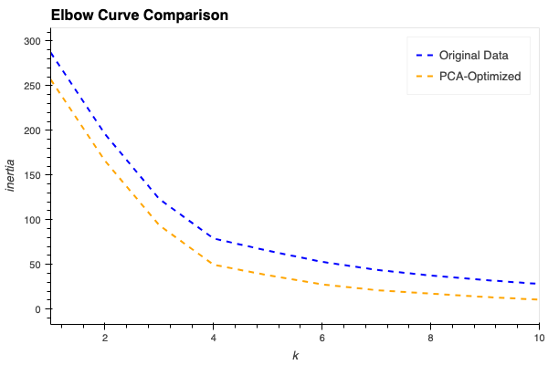

# Cryptocurrency Market Analysis Using k-Means Clustering
In this project, we tried to cluster cryptocurrencies using machine learning techniques, especially K-Means clustering. 
the goal is to identify patterns and group similar cryptocurrencies based on their market behavior over different time frames.
The analysis is refined using PCA(Principal Component Analysis)to optimize clustering.

## Technologies Used:
- Python
- Pandas
- Scikit-learn
- Plotly
- hvPlot
- holoviews

## Data Source 
the dataset crypto_market_data.csv (you can find it in the Resource folder) contains price change data over several time frames.

## Process
### Data Preparation
- Loading data, setting index
- Using StandardScaler() to normalize data

### Clustering Analysis

**K-Means clustering on Original Data**
- Using the Elbow method to find the optimal number of K(k=4 in the original dataset)

 
  
- Perform the K-Means method using the optimal k
- Visualized the results and clusters using scatter plots

**PCA Optimization**
- Applied PCA to reduce the number of features to 3 principal components.
- Using the Elbow method to find the optimal number of clusters(k=4 in the reduced dataset)
- Perform the K-Means method using the optimal k

  ## Visualization
  Elbow curves for original and PCA-optimized data.
  Scatter plots for original and PCA-optimized based on different fields.
  3D scatter plot using Plotly for PCA-optimized clustering

  ## Results
  - Identified the best value for k both k=4 for original and Pca optimized.
  - PCA optimized simplified the data while retaining 89.5% of the variance.(total_explained_variance=0.8950)
   

